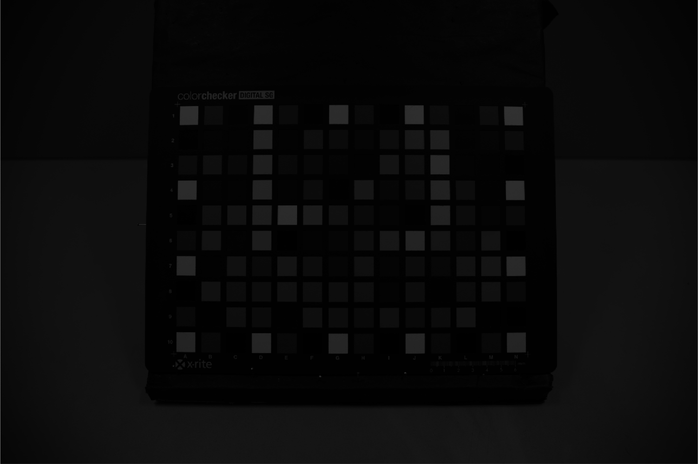
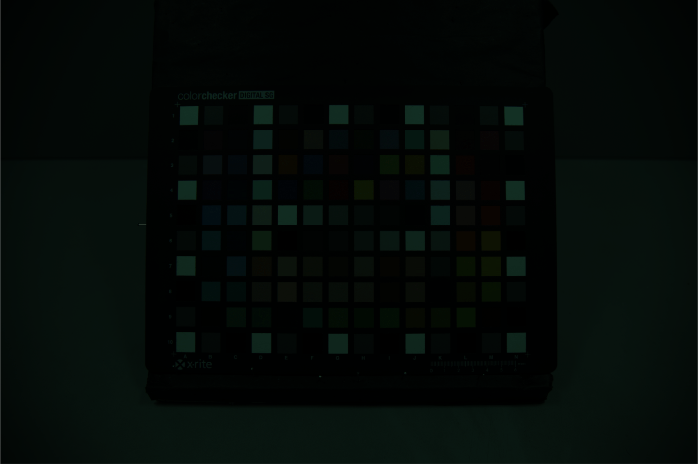
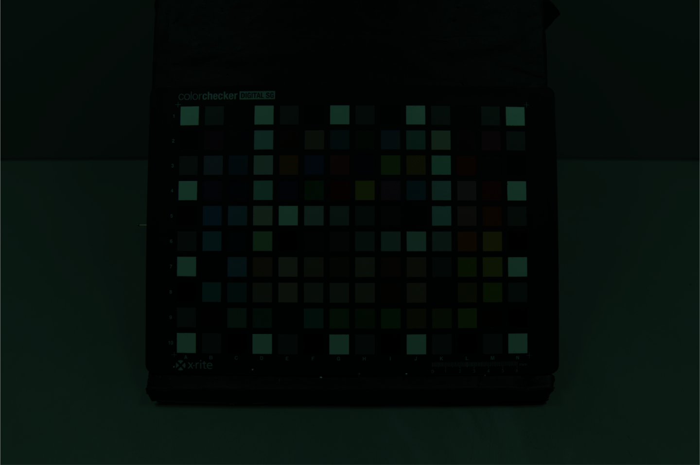
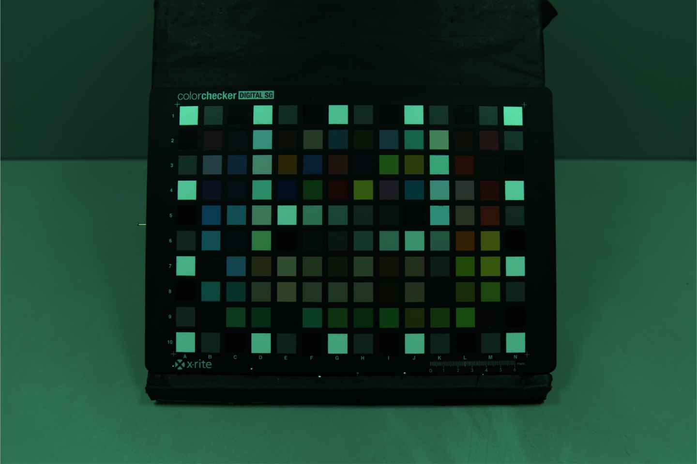
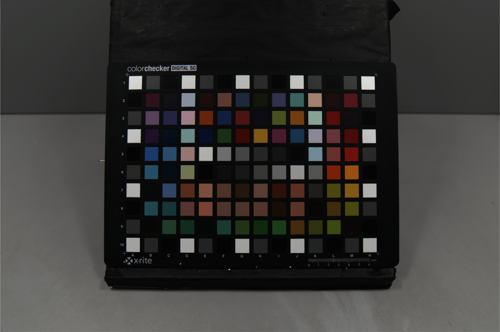
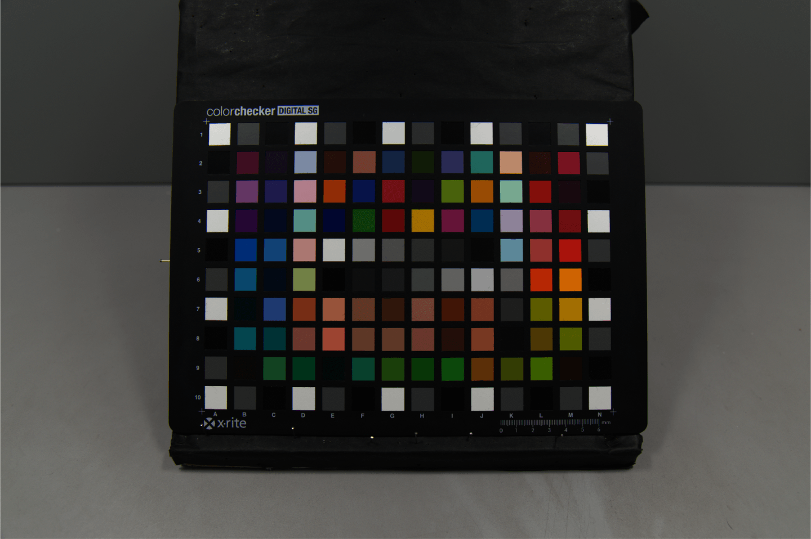
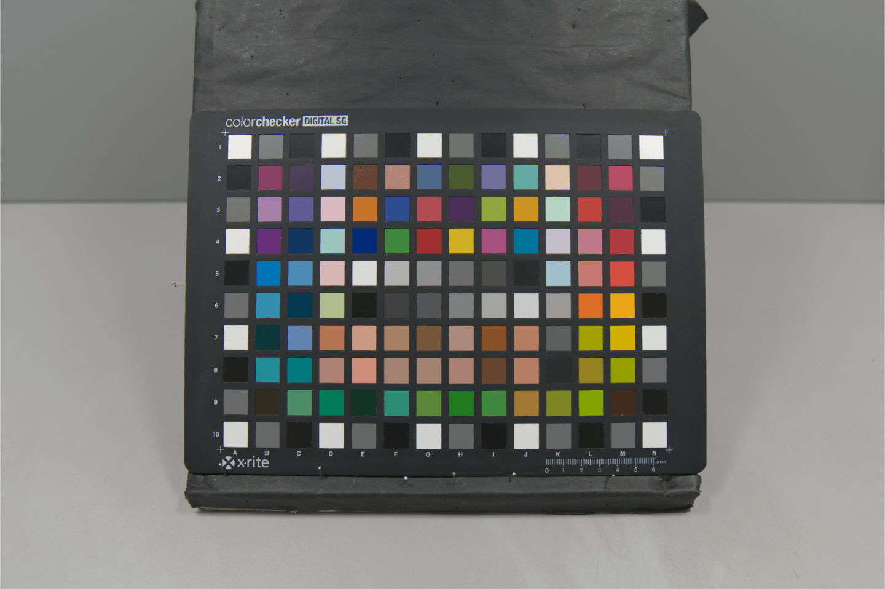

# MatRaw: Read and Process Camera Raw Data with MATLAB

MatRaw is a simple bridge tool for extracting completely *intact* image data from raw files of DSLRs/DSLMs. You can use it to convert raw files (.CR2, .NEF, .ARW, .RAF, .ORF, .DNG, etc.) to OS-friendly images (.PNG, .TIFF, .PPM, etc.) or MATLAB-accessible .MAT files, and/or to perform basic processing in ISP pipeline such as [raw noise reduction](http://theory.uchicago.edu/~ejm/pix/20d/tests/noise/index.html), [white balancing](https://en.wikipedia.org/wiki/Color_balance), and colorimetric characterization (aka color correction or [color space transformation](https://en.wikipedia.org/wiki/Color_space)).

Currently MatRaw only works on Windows. It uses [dcraw](https://www.cybercom.net/~dcoffin/dcraw/) to decode raw files. Please build or download the latest version of dcraw and place *dcraw.exe* to any directory listed in the PATH environment variable.


# Who it's for

MatRaw would be useful for

* :rainbow: color scientists who use cameras as measuring apparatus to record objects' colors and need to access raw signal that is proportional to the radiant quantities,
* :camera: sensor engineers who wish to evaluate sensors' performance irrespective of any post-processing,
* :mortar_board: image processing researchers who work on designing demosaicking, image fusion, and denoising algorithms, and
* :raising_hand: others who want to implement camera's color filter array data in a comprehensive way.


# What it does

* [`matrawread`](matrawread.m) is the core of MatRaw, which first calls dcraw.exe in the command line with *decoding only* option ("-4 -D", totally raw, no darkness level subtraction, no interpolation, no white balancing, no aberration correction), and then reads the .PGM image file into the workspace. It will only apply **minimum necessary processes** to the raw images, for example, darkness level subtraction or fixed pattern noise (FPN) reduction, pixel response non-uniformity (PRNU) compensation (aka flat field correction), intensity normalization, and demosaicking with or without color interpolation (demosaicking without color interpolation will combine a quadruplet in color filter array into a "large" RGB pixel, rather than "guessing" the missing values). *matrawread* is designed for treating cameras as **measuring apparatus ([Photogrammetry](https://en.wikipedia.org/wiki/Photogrammetry))**.

* [`matrawproc`](matrawproc.m) allows users to perform some basic processing in ISP pipeline to the raw image after *matrawread*, including digital signal amplification, white-balancing, and color space transformation. Images produced by *matrawproc* will have similar color appearance to the .JPG thumbnails saved by the camera, but in the absence of post-processing like brightness adjustment, distortion correction, color enhancement, etc. *matrawproc* is designed for making images appear **as realistic as our eyes perceive**.

# Usage

### Preparation

1. Build or download the latest version of [dcraw](https://www.cybercom.net/~dcoffin/dcraw/) and place *dcraw.exe* to any directory listed in the PATH environment variable, for example `c:\windows\`.
2. Download sample raw images [here](https://1drv.ms/u/s!AniPeh_FlASDhVwZp5Bgujheu0N4) and unzip it to `\sample_raw_files\` folder. (optional but recommended)
3. Download sample images [here](https://1drv.ms/u/s!AniPeh_FlASDhV8LayVbCIreBU65) for FPN and PRNU calibration. (optional, only for professional users)
4. Add `.\MatRaw\` and subfolders to MATLAB path.

### Basic usage

* To read and/or convert raw files:

    ```
    converted = matrawread(raw_dir, 'param', value, ...);
    ```

    some important optional arguments:

    * `cfa` -- color filter array, both Bayer and X-Trans are supported.
    * `interpolation` -- whether to perform color interpolation.
    * `darkness` -- darkness level which will be subtracted from the image.
    * `saturation` -- saturation level for data normalization.
    * `inbit/outbit` -- bit depth for input/output image.
    * `fpntemplate` -- fixed pattern noise template.
    * `prnutemplate` -- pixel response non-uniformity template.
    * ......

* To perform basic processing to the converted raw image:

    ```
    I = matrawproc(converted, 'param', value, ...);
    ```

    optional arguments:

    * `scale` -- amplification factor.
    * `wb` -- white balance method, can be 'manual', 'grayworld', or explicitly specified.
    * `cam2xyz` -- color matrix that converts pixel values from camera RGB color space to CIE1931 XYZ color space.
    * `colorspace` -- target RGB color space, both sRGB and Adobe RGB are supported.

See demo folder for more details.

# :warning: Attention

[`getrawparams`](utils/getrawparams.m) function is able to automatically identify the darkness and saturation levels given a raw file by executing `dcraw -v -d`. However, darkness and saturation levels reported by dcraw may be **WRONG** for some camera models (e.g., Canon EOS 5D Mark IV)! Run your own calibration if the output image had a weird appearance, as done in [demo2.m](demo/demo2.m).

# Q&A

* **Q1**: What are *fixed pattern noise* and *pixel response non-uniformity*?  
  **A1**: They are sensor noise that can be calibrated in advance and removed from each target image. See [this post](http://theory.uchicago.edu/~ejm/pix/20d/tests/noise/index.html) for the comprehensive introduction. They are worth the trouble only when extremely high color accuracy is required. Feel free to ignore them if you are not sure what they are.  
* **Q2**: How to get a fixed pattern noise template to perform FPN reduction?  
  **A2**: FPN template can be obtained by taking many black frames and averaging over them. See [demo4](demo/demo4.m) for more details.  
* **Q3**: How to get a pixel response non-uniformity template to perform PRNU compensation?  
  **A3**: PRNU template can be obtained by taking multiple frames for a uniformly lit object (a blank wall for instance) at the lowest ISO and about 1/2 to 1 stop down from sensor saturation, and then averaging over them after FPN subtracted. Again, see [demo4](demo/demo4.m) for more details.  
* **Q4**: Is it possible to remove image noise from other source?  
  **A4**: Other fixed noise can be removed by appropriately passing the `fpntemplate` argument. For example, thermal noise can be effectively removed by replacing a fixed pattern noise template with a thermal noise template, which is exactly the procedure that is carried out by the camera when *long exposure noise reduction* (LENR) is enabled.

# Screenshots

Following screenshots illustrate the rough workflow of MatRaw. Image was shot by a Nikon D3x DSLR.

##### Color filter array data (stored in 16-bit):




##### FPN removed:


##### Demosaicked:




##### PRNU compensated:




##### Normalized to 14-bit (output of *matrawread*):




##### Manual white balanced:




##### Transformed to linear sRGB color space (output of *matrawproc*):




##### Gamma corrected:



<br>

# License

Copyright 2019 Qiu Jueqin

Licensed under [MIT](http://opensource.org/licenses/MIT).