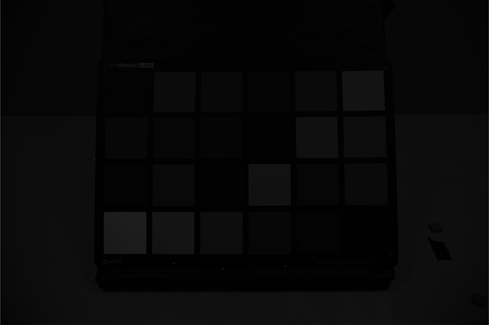
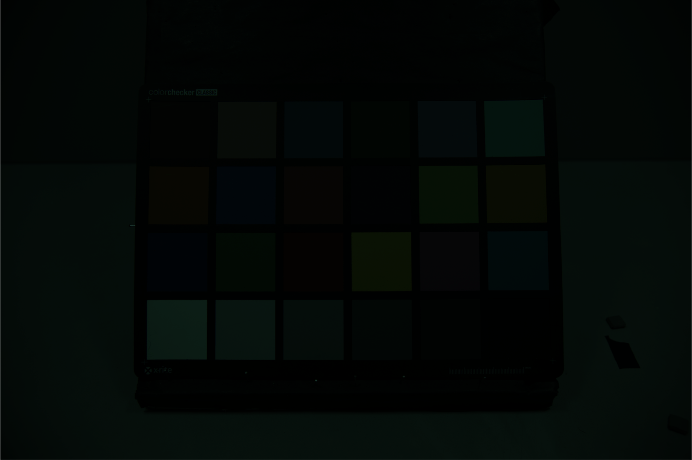
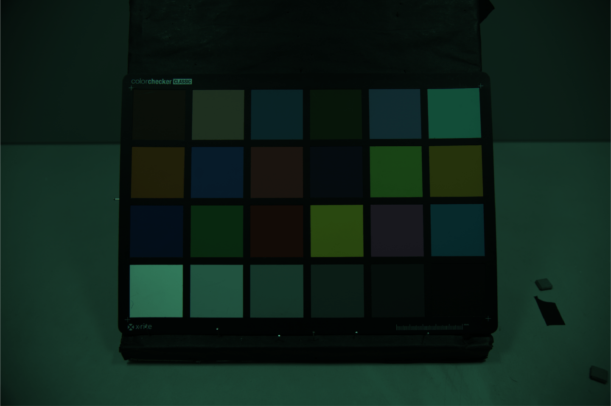
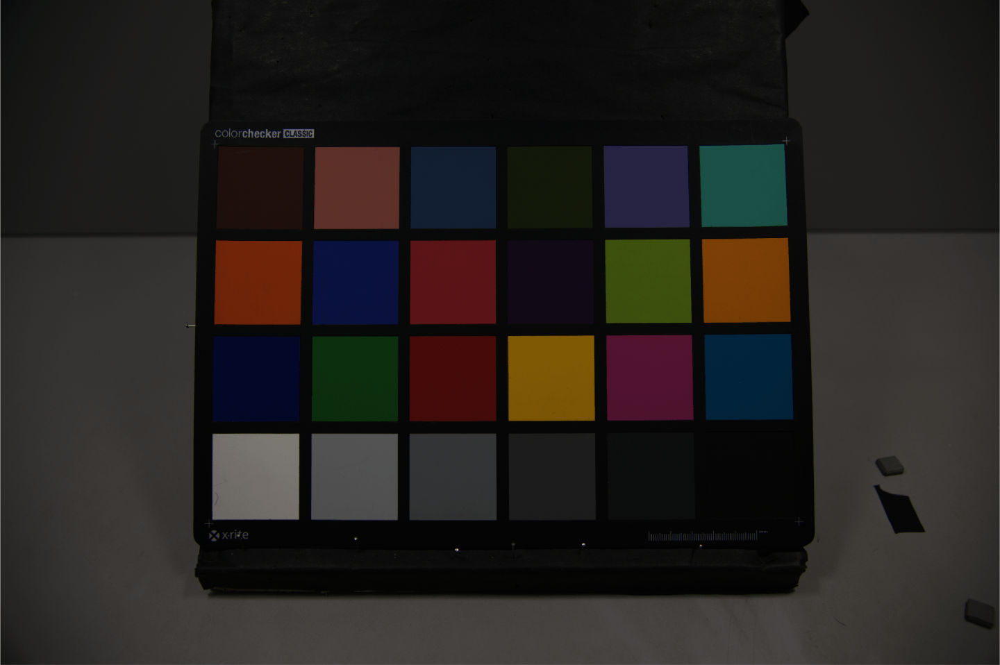
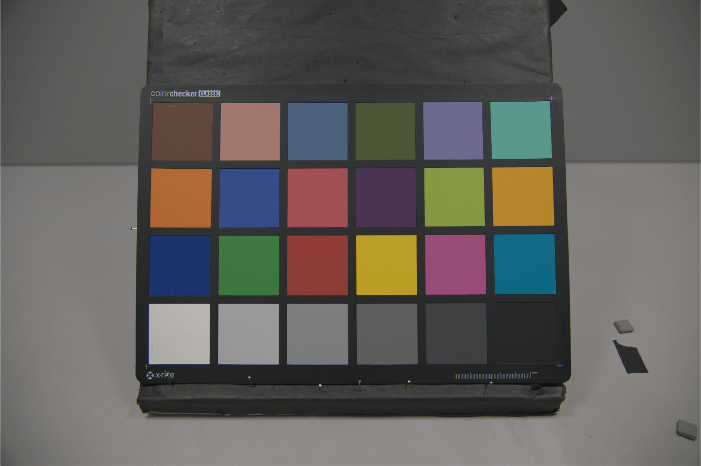

# MatRaw: Read and Process Camera Raw Data with MATLAB

MatRaw is a simple bridge tool to extract pristine image data from raw files of DSLRs/DSLMs. You can use it to convert raw files (.CR2, .NEF, .ARW, .RAF, .ORF, .DNG, etc.) to OS-friendly images (.PNG, .TIFF, .PPM, etc.) or MATLAB-accessible .MAT files, and/or to perform basic processing in ISP pipeline such as [white balancing](https://en.wikipedia.org/wiki/Color_balance) and colorimetric characterization (a.k.a color correction or [color space transformation](https://en.wikipedia.org/wiki/Color_space)).

Currently MatRaw only works on Windows. It uses [dcraw](https://www.cybercom.net/~dcoffin/dcraw/) to decode raw files. Please compile or download the latest version of dcraw and place *dcraw.exe* to any directory listed in the PATH environment variable.


# Who it's for

MatRaw can be useful for

* color scientists who need to access raw signal that linearly depends on radiant quantities,
* sensor engineers who wish to evaluate sensors' performance irrespective of any post-processing,
* image processing researchers who work on designing demosaicking, image fusion, and denoising algorithms, and
* others who want to implement camera's color filter array data in a comprehensive way.


# What it does

* *[matrawread](matrawread.m)* first calls dcraw.exe in the command line with *decoding only* option (totally raw, no darkness level subtraction, no interpolation, no white balancing, no aberration correction), and then reads the .PGM image file into the workspace. It will only apply **minimum necessary processes** to the raw images, for example, darkness level subtraction, intensity normalization, and demosaicking but without color interpolation (i.e., combines cfa quadruplet into a "large" RGB pixel, without "guessing" the missing values). Data returned by *matrawread* is exactly what camera "saw" during the exposure (up to a scale factor).

* *[matrawproc](matrawproc.m)* allows users to choose whether to perform some basic processing in ISP pipeline to the raw image after *matrawread*, including digital signal amplification, white-balancing, and color space transformation. Images produced by *matrawproc* will have similar color appearance to the .JPG thumbnails saved by the camera, but in the absence of post-processing like brightness adjustment, distortion correction, color enhancement, etc.


# Usage

1. Place latest version of *[dcraw.exe](https://www.cybercom.net/~dcoffin/dcraw/)* to any directory listed in the PATH environment variable, for example `c:\windows\`. 

   > dcraw version 9.28 can be found in `\utils` folder.

2. (optional) Download some sample raw images [here](https://1drv.ms/u/s!AniPeh_FlASDhVwZp5Bgujheu0N4) and unzip it to `\sample_raw_files` folder.

3. Add `.\MatRaw\` and subfolders to MATLAB path.

4. To read or convert raw files:

   ```
   raw = matrawread(raw_dir, 'param', value, ...);
   ```

5. To perform basic processing:

   ```
   I = matrawproc(raw, 'param', value, ...);
   ```

See demo folder for more details.


# Screenshots

Following screenshots illustrate the rough workflow of MatRaw. Image was shot by a Nikon D3x DSLR.

##### Color filter array data (stored in 16-bit):




##### Demosaicked:




##### Intensity normalized:




##### White balanced:


##### Transformed to linear sRGB color space:




##### Gamma corrected:



<br>

# License

Copyright 2019 Qiu Jueqin

Licensed under [MIT](http://opensource.org/licenses/MIT).